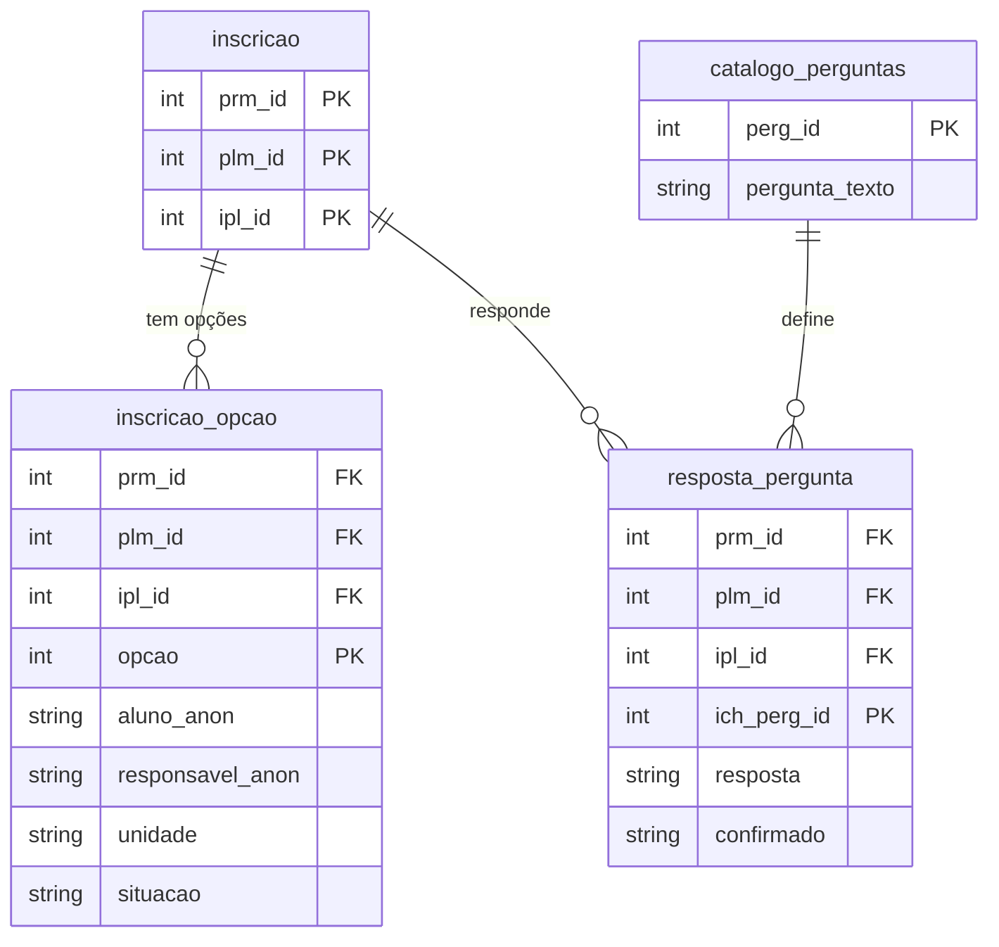

# 🎒 Claude Impact Lab 2026 | Dataset Inscrição Creche do Rio

 

---

> ### ⚠️ **Aviso Importante**
>
> Todos os dados do desafio passaram por rigoroso **processo de anonimização**, utilizando técnicas de aleatorização, generalização e supressão.
>
> **Indicadores gerados a partir dos dados NÃO representam a realidade**. Os dados apenas ilustram as dinâmicas do módulo de Inscrição Creche em anos anteriores.

---

## 📊 Acesso Rápido aos Dados

| 🗂️ **Tabela** | 📝 **Descrição** | 🔗 **Download** |
| --- | --- | --- |
| **Bases Inscrição Creche** | Módulo de inscrição e classificação para alunos de creche | [📥 Download](https://drive.google.com/drive/folders/17WJX5iVLxn0uK9dlQoGugQWLCKmxBnMM?usp=sharing) |
| **Oferecimento e Vagas** | Dados anteriores com as vagas ofertadas e alunos inscritos por unidades parceiras e públicas | [📥 Download](https://drive.google.com/drive/folders/1cCOQMwfbGTRWMlAKIU4bU4BK1JV7IUNz?usp=sharing) |
| **Microáreas SME/IPP** | Bases para a criação de mapas com a dinâmica territorial usada pela SME | [📥 Download](https://drive.google.com/drive/folders/1xMgfHz2rkPt96WuAohEfokIjyJTuHWAK?usp=sharing) |
| **Nascidos Vivos RJ** | Base de nascidos vivos no município, usada como referência de demanda potencial | [📥 Download](https://docs.google.com/spreadsheets/d/1TXFEJMcA0JRKCndkmeesryLSKxDySRGG/edit?usp=sharing) |

---

## 📚 Materiais de Apoio

- Apresentação: [Acessar]([https://docs.google.com/presentation/d/1Teh1Al1ZPaymLhTAd9-ZyVkjh02sxnyI/edit?usp=sharing](https://docs.google.com/presentation/d/183Pq5Mz2FYAY-0cI9RvuxW94zh-cundQ/edit?usp=sharing&ouid=118222130256698885795&rtpof=true&sd=true)
- Briefing (problema completo): [Acessar](https://docs.google.com/document/d/1jZenYEKR2hJOVrxLXWM0xjxmoiohAqEl/edit?usp=sharing)

---

## 🎯 O Desafio

## Educação pública: Inteligência na Fila da Creche

O paradoxo é claro: de um lado, vagas ociosas nas creches da rede pública; de outro, famílias em listas de espera expressivas.

Um único processo de Inscrição Creche da SME-Rio reúne mais de 45 mil inscrições, distribuídas por 872 unidades entre creches e EDIs — cada família indicando até cinco opções por ordem de preferência. Entre a inscrição e a matrícula existem três fases de retaguarda geridas manualmente pelas 11 Coordenadorias Regionais de Educação:

- o **planejamento da oferta**, que ainda se apoia na fila do ano anterior;
- a **classificação**, ordenada por uma régua de pontuação redefinida a cada processo;
- a **convocação**, feita por telefone, e-mail e WhatsApp sem rastreio, sem painel que mostre há quanto tempo uma vaga aguarda confirmação.

A fila, portanto, não é de escassez — é de descompasso entre oferta e demanda por território e turno.

### O que esperamos dos times

Transformar cinco anos de dados reais (2021–2025) em inteligência acionável que responda: quantas vagas abrir e onde, em que ordem chamar a fila e como garantir que a família chegue à vaga dentro do prazo — otimizando, ao mesmo tempo, o processo de classificação e convocação.

📄 [Link para o problema completo](https://docs.google.com/document/d/1jZenYEKR2hJOVrxLXWM0xjxmoiohAqEl/edit?usp=sharing)
📊 [Link para a apresentação](https://docs.google.com/presentation/d/1Teh1Al1ZPaymLhTAd9-ZyVkjh02sxnyI/edit?usp=sharing)

---

## 📘 Dicionário de Dados

### Escopo

A extração cobre 5 processos seletivos: **179 (2021)**, **181 (2022)**, **184 (2023)**, **194 (2024)** e **195 (2025)**. O processo vigente (2026) não está incluído.

### Modelo de Dados

    Loading

### inscricao_opcao — Query A (extração principal)

Uma linha por **opção de creche escolhida** dentro de uma inscrição. Uma criança pode ter até 5 linhas (uma por opção) e reaparecer em anos diferentes. Junta com `resposta_pergunta` pela chave `(prm_id, plm_id, ipl_id)`.

| Coluna | Tipo | Descrição |
| --- | --- | --- |
| `ano` | int | Ano do processo seletivo (2021–2025) |
| `prm_id` | int | Identificador do processo de matrícula |
| `plm_id` | int | Identificador do polo/lote dentro do processo |
| `ipl_id` | int | Identificador da inscrição dentro do polo |
| `opcao` | int | Número da opção de creche escolhida (1ª, 2ª...) |
| `unidade` | string | Código da unidade escolar (creche) |
| `nome_unidade` | string | Nome da unidade escolar |
| `grupamento` | string | Faixa/grupamento etário-curricular (ex.: Berçário, Maternal) |
| `horario` | string | `Integral` ou `Parcial` |
| `ficha` | string, pode ser nulo | Código da ficha de inscrição impressa |
| `data_criacao` | datetime | Data/hora de criação da inscrição |
| `aluno_anon` | string | Código anonimizado da criança — estável entre opções e entre os 5 processos em que ela aparecer |
| `sexo_crianca` | string | Sexo da criança |
| `nascimento_aluno_anomes` | string (`yyyy-MM`) | Ano-mês de nascimento da criança — generalizado por privacidade (sem o dia) |
| `responsavel_anon` | string, pode ser nulo | Código anonimizado do responsável 1 — nulo se não houver responsável cadastrado |
| `CEP` | string, pode ser nulo | CEP do endereço do responsável |
| `bairro` | string, pode ser nulo | Bairro do endereço do responsável |
| `situacao` | string | Status da inscrição/opção: Ativo, Bloqueado, Excluído, Selecionado, Lista de espera, Selecionado da lista, Cancelado, Confirmado, Cancelado pelo sistema, Cancelado na confirmação |

**Filtros já aplicados na extração:** exclui situações "Excluído" e "Cancelado pelo sistema"; apenas os 5 processos listados no escopo.

### resposta_pergunta — Query B (respostas de classificação)

Uma linha por **pergunta respondida** dentro de uma inscrição (formato longo). Chave: `(prm_id, plm_id, ipl_id, ich_perg_id)`.

| Coluna | Tipo | Descrição |
| --- | --- | --- |
| `ano` | int | Ano do processo |
| `prm_id`, `plm_id`, `ipl_id` | int | Chave da inscrição — liga com `inscricao_opcao` |
| `ich_perg_id` | int | Identificador da pergunta *nesse processo específico* (muda a cada ano) |
| `pergunta_texto` | string, pode ser nulo | Texto completo da pergunta (catálogo central, estável entre processos) |
| `pergunta_legenda` | string, pode ser nulo | Rótulo curto usado em legendas/gráficos |
| `pergunta_ordem` | int | Ordem de exibição da pergunta no formulário |
| `resposta` | `Sim` / `Nao` / nulo | Resposta dada pela família |
| `confirmado` | `Sim` / `Nao` / nulo | Se a resposta foi confirmada/validada |

**Filtro já aplicado na extração:** apenas respostas ativas.

### catalogo_perguntas — Query C (bônus)

Uma linha por pergunta distinta usada em cada processo/ano — útil para comparar se a redação de uma pergunta mudou de um ano para outro. Traz `perg_id` (chave estável no catálogo geral), `pergunta_texto`, `pergunta_legenda` e `ich_perg_id` (a instância daquele ano).

---

## 🔒 Processo de Anonimização

### 🛡️ Técnicas Aplicadas

| 🔧 Técnica | 📝 Descrição |
| --- | --- |
| 🔐 **Códigos artificiais** | Criança e responsável recebem códigos (`aluno_NNNNNNN`, `responsavel_NNNNNNN`) gerados a partir de uma chave natural (CPF/DNV/NIS/nome+nascimento); o mesmo código se repete para a mesma pessoa em todas as opções e nos 5 processos em que ela aparecer |
| 📅 **Generalização temporal** | Nascimento da criança exposto só como ano-mês (`yyyy-MM`), sem o dia; nascimento do responsável não é exposto |
| 📍 **Generalização geográfica** | Do endereço do responsável só saem bairro e CEP — sem logradouro, número ou telefone |
| 🚫 **Supressão de identificação direta** | Nome do responsável, CPF, DNV, NIS e demais identificadores diretos não são expostos, apenas os códigos anonimizados |

### ⚠️ Impactos da Anonimização

**❌ O que NÃO representa a realidade:**

- Indicadores absolutos
- Endereço exato de famílias e unidades (fica só em nível de bairro/CEP)
- Identidade real de crianças e responsáveis
- Data exata de nascimento das crianças

**✅ O que está preservado:**

- Sequência temporal do processo (inscrição → classificação → convocação)
- A trajetória de uma mesma criança/responsável entre opções de creche e entre os 5 anos do processo
- Lógica territorial ao nível de bairro
- Relações entre as bases (inscrição, opções, respostas de classificação)
